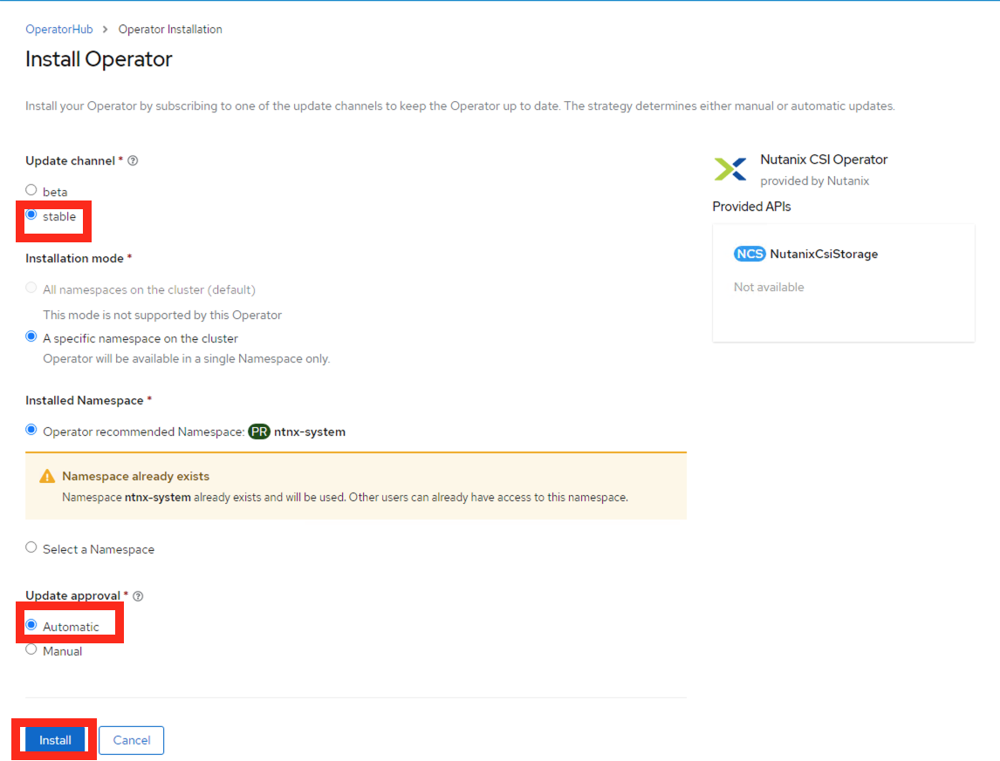

# OCP: Deploy Nutanix CSI for OCP

In this section we will enable your deployed OCP cluster to have access to Nutanix HCI storage in the form of StorageClass, Physical Volumes and Pysical Volume claims.

We will also install kubernetes operator provided by Nutanix to maintain the lifecycle of operator.

See [What are Kubernetes Operators?](https://docs.openshift.com/container-platform/4.7/operators/understanding/olm-what-operators-are.html) for more information.

OpenShift provides a easy way of implementing these third-party operators via OperatorHub from the cluster manager GUI .

As the Nutanix CSI Operator provides the following capabilities as of now, we will install it to manage all our Nutanix StorageClass in this OCP cluster.

-   Basic install
-   Seamless upgrades (Manual or Automatic)

In future Nutanix CSI Operator may provide the following additional features:

-   Full lifecycle
-   Deep insights
-   Autopilot

## Install Nutanix CSI Operator

1.  Login to you Windows Tools VM using the following credentials;

    -   **Username** - <administrator@ntnxlab.local>
    -   **Password** - nutanix/4u

2.  Using Chrome browser browse to Console URL you obtained in the
    previous section.

    ```url
    https://console-openshift-console.apps.<initials>1.ntnxlab.local
    ```

    ```url
    # example URL
    # https://console-openshift-console.apps.xyz1.ntnxlab.local
    ```

3.  Use your credentials to Login

    -   **Username** - kubeadmin
    -   **Password** - password from previous section
        `ocp_cluster_login`{.interpreted-text role="ref"}

4.  Click on **Log in** (if you are not already logged in)

5.  Click on **Operator** \> **Operator Hub**

6.  You will see all third party operators categorised by solution driven use cases (e.g. Big Data, Database, etc)

    

    This is in principle similar to Nutanix Calm Marketplace where you can request and install applications.

7.  In the **Filter by Keyword** text box, type **Nutanix** to find the Nutanix CSI Operator

8.  Click on the **Nutanix CSI Operator**, verify Operator version to be at least `2.5.1` and click on **Install**

    

    Also make sure to check the supported orchestration (RH OCP platforms)

9.  In the Operator install wizard choose the following:

    -   **Update channel** - stable
    -   **Operator recommended Namespace** - ntnx-system
    -   **Update approval** - Automatic (admins usually choose Manual option where control over updates is necessary)

    

10. Click on **Install**

11. Once installed you will see the operator in **Operator** \>
    **Installed Operators**


You have succesfully installed the Nutanix CSI operator to take care of StorageClass installation and upgrades.

:::info

Operators can also be installed using `oc` commandline. For more information refer to OCP documentation [here.](https://docs.openshift.com/container-platform/4.7/operators/admin/olm-adding-operators-to-cluster.html#olm-installing-operator-from-operatorhub-using-cli_olm-adding-operators-to-a-cluster)

:::

## Install StorageClass

From now you will be performing commands in **LB_DNS** VM's console.

The lab instructions will have templates for these commands. You will have to change necessary areas to suit your HPOC/SPOC details.

:::info

We suggest doing the following when modifications to commands are required:

1.  Edit code from lab instructions using vi/nano/vim

2.  Modify the required fields (highlighted)

3.  Paste the commands into the terminal of LB_DNS vm through Calm UI

:::

Use the following key combinations to paste content into Calm invoked terminal. 

import Tabs from '@theme/Tabs';
import TabItem from '@theme/TabItem';

<Tabs groupId="operating-systems">
    <TabItem value="mac" label="macOS">Use <b>Command + v</b> to paste.</TabItem>
    <TabItem value="win" label="Windows">Use <b>Shift + Insert</b> to paste.</TabItem>
</Tabs>

    
1.  In Calm go to your **Applications** > **Openshift ocp1** application

2.  Go to the **Services**

3.  Select your **LB_DNS** service

4.  Click on **Open Terminal**

    

    The terminal will open in a new browser tab

5.  Export the OCP cluster\'s KUBECONFIG file to environment so we can perform `oc` commands

    ``` bash
    export KUBECONFIG=~/openshift/auth/kubeconfig
    ```

6.  Create a kubernetes secret that the StorageClass can use to access the Nutanix HCI storage

    Copy the following Secret configuration script, modify required fields (high-lighted)

    **Open a text editor (vi / nano), paste the contents below and change the fields indicated to suit your environment. Example is also provided**

    **Be sure to use your environment\'s details for the following fields:**

    -   Prism Element IP
    -   Prism Element UserName
    -   Prism Element Password

    ```bash {4}
    cat << EOF > csi_secret.yaml
    apiVersion: v1
    kind: Secret
    metadata:
      name: ntnx-secret
      namespace: ntnx-system
    stringData:
      key: <Prism Element IP>:9440:<Prism Element UserName>:<Prism Element Password>    # << change this
      # example: 
      # key: 10.38.2.71:9440:admin:password
    EOF
    ```

    ``` bash
    # Modify the highlighted fields to suit your environment
    vi csi_secret.yaml
    ```

    ``` bash
    # Create the secret 
    oc apply -f csi_secret.yaml
    ```

    ``` bash
    # example output here for the above command
    # secret/ntnx-secret created
    ```

7.  Copy the following StorageClass configuration script, modify required fields and execute it in the command line

    -   Data Services IP and
    -   Storage Container Name

    ```zsh {4}
    cat << EOF >  storageclass.yaml
    apiVersion: storage.k8s.io/v1
    kind: StorageClass
    metadata:
        name: nutanix-volume
    provisioner: csi.nutanix.com
    parameters:
      csi.storage.k8s.io/provisioner-secret-name: ntnx-secret
      csi.storage.k8s.io/provisioner-secret-namespace: ntnx-system
      csi.storage.k8s.io/node-publish-secret-name: ntnx-secret
      csi.storage.k8s.io/node-publish-secret-namespace: ntnx-system
      csi.storage.k8s.io/controller-expand-secret-name: ntnx-secret
      csi.storage.k8s.io/controller-expand-secret-namespace: ntnx-system
      csi.storage.k8s.io/fstype: ext4
      dataServiceEndPoint: <Data Services IP>:3260   # << change this
      # example: 
      # dataServiceEndPoint: 10.38.2.72:3260
      storageContainer: <Storage Container Name>     # << change this
      # example: 
      # storageContainer: Default
      storageType: NutanixVolumes
    allowVolumeExpansion: true
    reclaimPolicy: Delete
    EOF
    ```

    ``` bash
    # Modify the highlighted fields to suit your environment
    vi storageclass.yaml
    ```

    ``` bash
    # Create the storage class 
    oc apply -f storageclass.yaml
    ```

    ``` bash
    # example output here for the above command
    # storageclass.storage.k8s.io/nutanix-volume created
    ```

8.  Make this your default StorageClass

    ``` bash
    oc patch storageclass nutanix-volume -p '{"metadata": {"annotations":{"storageclass.kubernetes.io/is-default-class":"true"}}}'
    #
    oc get sc
    ```
9.  List your StorageClass

    ``` bash
    oc get StorageClass -A
    ```

    ``` bash
    # example output here for the above command
    # NAME             PROVISIONER       RECLAIMPOLICY   VOLUMEBINDINGMODE   ALLOWVOLUMEEXPANSION   AGE
    # nutanix-volume   csi.nutanix.com   Delete          Immediate           true                   45h
    ```

10. Create a subscription of the Operator to attach it to `ntnx-system`
    namespace

    ``` bash
    cat << EOF | oc create -f -
    apiVersion: crd.nutanix.com/v1alpha1
    kind: NutanixCsiStorage
    metadata:
        name: nutanixcsistorage
        namespace: ntnx-system
    spec:
        namespace: ntnx-system
    EOF
    ```

    ``` bash
    # example output here for the above command 
    # nutanixcsistorage.crd.nutanix.com/nutanixcsistorage created
    ```

We have sucessfully installed Nutanix StorageClass so we can provision Physical Volumes (PV) and Physical Volume Claims (PVC) for the applications we will be deploying in this OCP cluster.